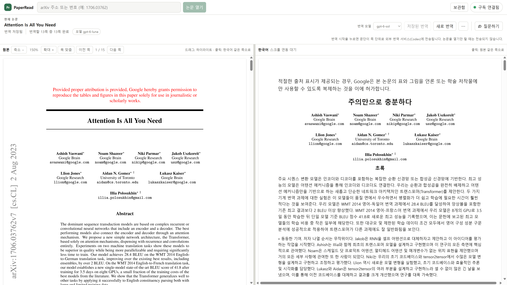
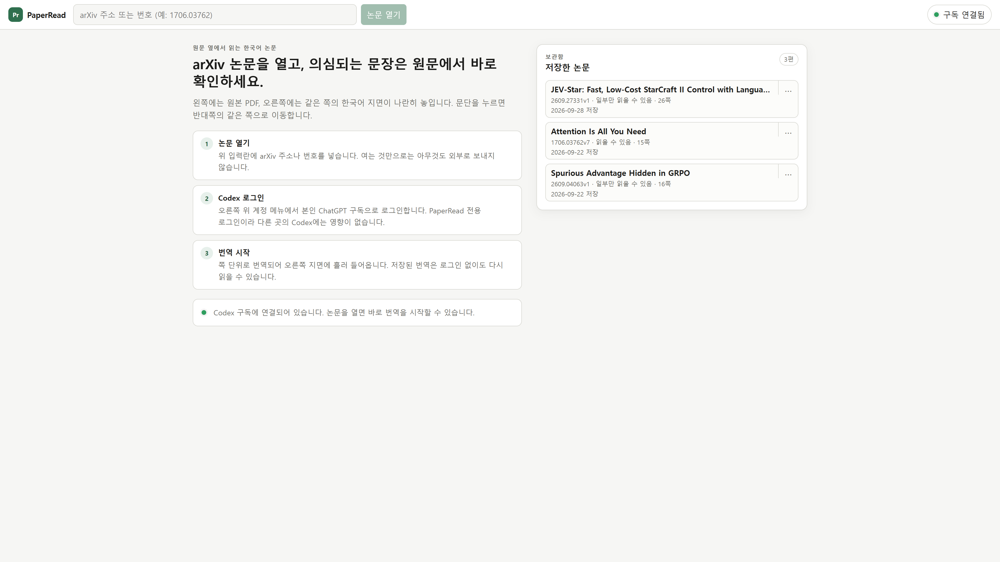
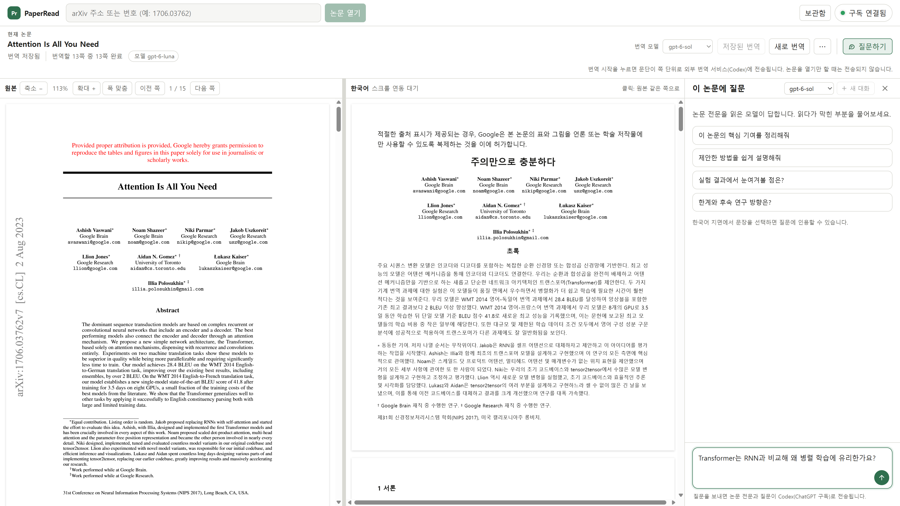

# PaperRead

PaperRead는 arXiv 논문의 원본 PDF와 한국어 번역을 나란히 읽고, 논문 내용에 질문할 수 있는 개인용 로컬 앱입니다. 각 사용자가 자기 PC에서 실행하고 자기 ChatGPT 구독으로 로그인합니다.

논문을 열기만 하면 번역이나 질문 요청을 보내지 않습니다. 번역 시작과 질문 전송은 사용자가 직접 누를 때만 실행됩니다. 사용자가 번역이나 질문을 요청하면 해당 논문 내용이 Codex CLI를 거쳐 OpenAI에 전송됩니다. API 키는 필요하지 않습니다.



실제 로컬 실행 화면입니다. 예시 논문은 Vaswani 외, [Attention Is All You Need](https://arxiv.org/abs/1706.03762)이며, 한국어는 저장된 번역입니다.

<details>
<summary>첫 화면·보관함과 질문 패널 보기</summary>

첫 화면에서 논문을 열고, 보관함에서 저장한 논문을 다시 읽습니다.



읽기 화면 옆에서 질문을 작성합니다. 아래는 질문 전송 전 화면입니다.



</details>

## 필요한 환경

- Windows(검증 환경). macOS 실행 방법도 아래에 안내하지만, 실제 Mac에서 로그인·번역·PDF 표시는 아직 검증하지 않았습니다.
- Node.js 24 이상
- [공식 Codex CLI](https://developers.openai.com/codex/cli/) 설치 및 실행 경로 등록
- ChatGPT 구독

Codex CLI 로그인은 PaperRead 화면의 계정 메뉴에서 시작합니다. 앱은 자료 폴더 아래 `.codex-home`에서 별도 로그인을 관리하며, 터미널의 `codex login`이나 다른 Codex 로그인은 사용하지 않습니다.

## 설치 및 실행

Windows의 Git Bash 또는 macOS의 터미널(zsh/bash)에서 이 저장소를 내려받고 프로젝트 폴더로 이동한 뒤 실행합니다. macOS에서는 Node.js와 공식 Codex CLI를 설치하고 `codex --version`으로 실행 경로를 확인하세요.

```bash
git clone https://github.com/nkjunbc/PaperRead.git
cd PaperRead
npm ci
npm run build
PAPERREAD_INDEX="$(pwd)/dist/client/index.html" node --import tsx src/server/main.ts
```

브라우저에서 <http://127.0.0.1:7327>을 엽니다. 서비스를 끝내려면 실행 중인 터미널에서 `Ctrl+C`를 누릅니다. 자세한 화면 사용법과 PowerShell 실행 방법은 [docs/사용법.md](docs/사용법.md)를 참고하세요.

## 데이터와 계정

- 서버는 현재 PC의 `127.0.0.1`에서만 열립니다. 이 앱은 여러 사용자가 접속하는 원격 서버로 배포하는 용도가 아닙니다.
- 논문, 번역, 하이라이트와 질문 대화는 기본적으로 `%LOCALAPPDATA%\PaperRead`에 저장됩니다.
- macOS 자료 경로는 `~/.local/share/paperread`이며, `XDG_DATA_HOME`을 설정했다면 그 경로 아래 `paperread`를 사용합니다(`src/server/main.ts:21`).
- Codex CLI 인증은 같은 자료 폴더의 `.codex-home`에 저장됩니다. 이 폴더를 공유하거나 Git에 올리지 마세요.
- `PAPERREAD_DATA`를 설정할 때 프로젝트 저장소 바깥의 폴더를 사용하세요. 앱 자료 폴더를 저장소 안에 두면 논문 파일이 Git에 포함될 수 있습니다.
- PaperRead는 비밀번호, 쿠키, 토큰, API 키를 수집하지 않습니다. 로그아웃은 PaperRead 앱 전용 로그인만 끊습니다.
- arXiv 원문은 논문을 열 때 취득합니다. 논문 전문은 사용자가 번역을 시작하거나 질문을 전송할 때 Codex CLI를 통해 OpenAI에 전달됩니다.

## 다시 빌드하기

```bash
npm run build
```

## 라이선스

[MIT](LICENSE)
